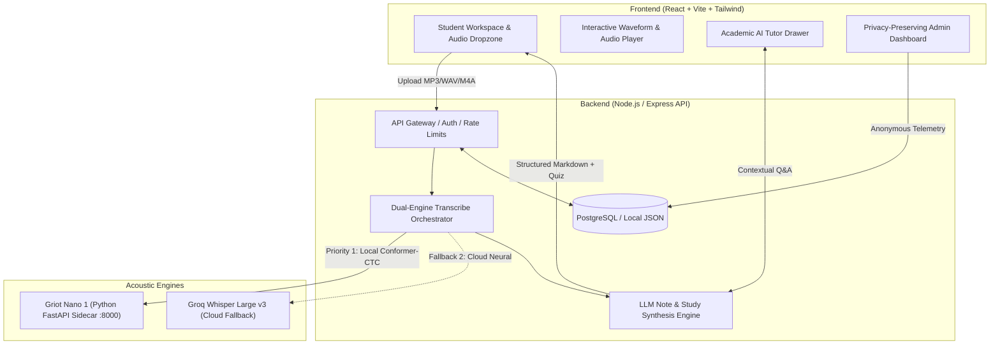

# LectureScribe ®

> **Turn your lectures into structured notes with dual-engine AI speech intelligence.**

[](https://kofi011.github.io/lecturescribe/)
[](https://lecturescribe-backend.onrender.com/api/health)
[](docs/ARCHITECTURE.md)

---

##  System Architecture

LectureScribe uses a dual-engine speech-to-text pipeline combining an on-device local Conformer-CTC microservice (**Griot Nano 1**) with cloud-accelerated **Groq Whisper AI** fallback, followed by LLM-powered note synthesis and interactive academic tutoring.



---

##  Repository Structure

```text
LectureScribe/
├── backend/                  # Node.js / Express REST API Service
│   ├── src/
│   │   ├── db/               # PostgreSQL & persistent storage layer
│   │   ├── routes/           # REST endpoints (auth, upload, lectures, analytics)
│   │   ├── services/         # Core business logic (transcribe, noteGen, askLecture, auth, trial)
│   │   └── server.js         # Server entry point & reverse-proxy configuration
│   └── tests/                # Automated unit & integration test suites
│       ├── auth.test.js      # Password hashing, JWT & admin verification
│       ├── db.test.js        # DB seeding, connection & query tests
│       ├── admin_e2e.test.js # Access control & privacy guarantee tests
│       └── index.js          # Master test runner (`npm test`)
│
├── frontend/                 # React 18 + Vite Single Page Application
│   ├── src/
│   │   ├── components/       # Reusable UI components (Nav, AudioPlayer, Tutor, Waveform)
│   │   ├── pages/            # View routers (Landing, Workspace, Results, Admin, Auth, Trial)
│   │   ├── utils/            # Local storage, analytics client, PDF exporter, inactivity timer
│   │   ├── config.js         # Unified client config & API URL resolution
│   │   └── App.jsx           # Root application container & navigation router
│   └── public/               # Favicon and static brand assets
│
├── griot_sidecar/            # Python / FastAPI Speech Microservice (Port 8000)
│   ├── main.py               # Griot Nano 1 Conformer-CTC acoustic model server
│   ├── requirements.txt      # PyTorch, Transformers, SoundFile, FastAPI
│   └── test_sidecar.py       # Microservice health probe & transcription test
│
├── docs/                     # Comprehensive Architecture & Project Specifications
│   ├── ARCHITECTURE.md       # Technical design, dual-engine flow & API schema
│   ├── MONITORING.md         # Privacy-preserving admin monitoring specification
│   ├── REQUIREMENTS.md       # Functional & non-functional requirements
│   ├── PROJECT.md            # Product overview & user personas
│   ├── DESIGN.md             # Visual aesthetics, typography & UI tokens
│   └── TASKS.md              # Phase-by-phase implementation checklist
│
├── branding/                 # Brand identity concepts, Monogram & SVG assets
├── scripts/                  # CI/CD deployment automation scripts
│   └── deploy_gh_pages.js    # Automated production deployment to GitHub Pages
├── render.yaml               # Infrastructure-as-Code for Render Cloud Backend & DB
└── package.json              # Monorepo root scripts & orchestration
```

---

##  Quick Start (Local Development)

### Prerequisites
- **Node.js**: v18+ (v20+ recommended)
- **Python**: 3.10+ (for Griot Nano 1 speech sidecar)
- **Groq API Key**: [Get free key here](https://console.groq.com/keys)

### 1. Clone & Install Dependencies
```powershell
git clone https://github.com/Kofi011/lecturescribe.git
cd lecturescribe
npm install
npm --prefix frontend install
npm --prefix backend install
```

### 2. Configure Environment Variables
Create `backend/.env`:
```ini
PORT=5000
GROQ_API_KEY=gsk_your_groq_api_key_here
JWT_SECRET=your_jwt_secret_key_here
SESSION_SECRET=your_session_cookie_secret_here
# Optional: Set DATABASE_URL for Postgres. If omitted, uses data/*.json
DATABASE_URL=
```

### 3. Run the Services

You can run individual services or use root scripts:

| Command | Description | Port |
| :--- | :--- | :--- |
| `npm run backend` | Starts Node.js backend with `--watch` | `http://localhost:5000` |
| `npm run frontend` | Starts Vite React client with HMR | `http://localhost:5173` |
| `npm run sidecar` | Starts Python Griot Nano 1 microservice | `http://127.0.0.1:8000` |
| `npm test` | Runs master backend test suite | — |

---

##  Security & Privacy Guarantees

As documented in [`docs/MONITORING.md`](docs/MONITORING.md):
- **Zero Content Leakage**: Admin dashboards structurally exclude user transcripts, lecture titles, audio files, names, and emails.
- **No Session Reconstruction**: Temporary session tokens are excluded from all admin feeds.
- **Cross-Domain Secure Cookies**: Production sessions use `SameSite: None` and `Secure: true` with strict HTTP-Only flags.
- **Brute-Force Rate Limiting**: Dedicated rate-limiters on authentication and audio ingestion routes.

---

##  Cloud Deployment

- **Frontend**: Hosted on **GitHub Pages** (`https://kofi011.github.io/lecturescribe/`) via automated `npm run deploy:pages`.
- **Backend & PostgreSQL**: Managed cloud deployment on **Render** configured via [`render.yaml`](render.yaml).
- **Health Check**: `GET https://lecturescribe-backend.onrender.com/api/health`

---

## 📄 License & Attribution
LectureScribe ® — Built with React, Node.js, Groq AI, and Conformer-CTC Speech Intelligence.
